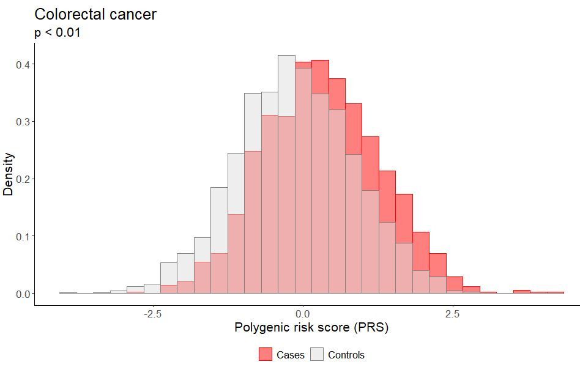
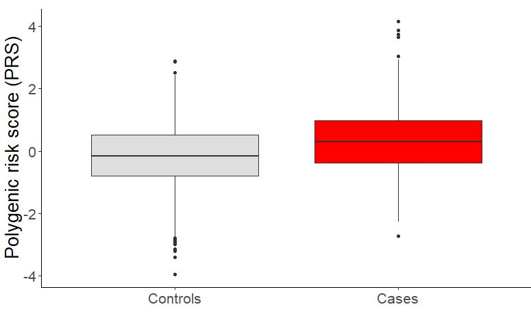

# CSE284_ML4PRS

## Predicting Colorectal Cancer Risk Using a Polygenic Risk Score and Machine Learning Methods

data source: https://odap-ico.github.io/PRS_tutorial/#whats-a-polygenic-risk-score

### Repository Structure

- **data/**

  - **raw/** – Original genotype and phenotype datasets
  - **processed/** – Cleaned and prepared datasets used for modeling
- **notebooks/**

  - **Data Preprocessing and PRS/Data Preprocessing and PRS.Rmd** – R Markdown notebook for data preprocessing and PRS code generation
  - **models.ipynb** – Machine learning models
- **results/**

  - **figures/** – Generated plots and visualizations (PRS distributions, model comparisons)
  - **PRS/** – Intermediate and final outputs from the PRS construction pipeline
    - **1_snps_extraction/** – Extract SNPs from genotype data
    - **2_SNPs_alignament_check/** – Check and align alleles with GWAS effect sizes
    - **3_QC/** – Quality control filtering and variant checks
    - **4_PRS_calculation/** – Final PRS computation outputs
  - **tables/** – Model performance tables and summary statistics
- **scripts/** – Python code for data cleaning and quality control
- **tools/**

  - **bcftools/** – bcftools used for processing VCF genotype files
  - **plink2/** – PLINK2  used for genotype processing and PRS calculation

### Background

Colorectal cancer (CRC) is the third most diagnosed cancer in the world and accounted for 9.4% of cancer-related deaths in 2020. It is estimated that the global incidence of CRC will more than double by 2035. CRC occurs exclusively in the colon or rectum. Currently, the most effective method of preventing and managing CRC is screening average-risk individuals. Current known CRC risk factors include family history of CRC, inflammatory bowel diseases, obesity, smoking, consumption of red meats, alcohol consumption, and tobacco use. Over two hundred single-nucleotide polymorphisms (SNPs) have been implicated as causal or protective for CRC. In this study, we aim to build a polygenic risk score (PRS) for CRC and compare its discrimination with that of machine learning (ML) models to identify patients with CRC.

### Dataset & Preprocessing

This study employs a case–control design to evaluate the performance of a PRS for CRC. Publicly available data from the GitHub repository (https://github.com/odap-ico/PRS_tutorial) will be used. The dataset includes individual-level genotype data in VCF format, effect size estimates for 205 single-nucleotide polymorphisms (SNPs) associated with CRC, and phenotype labels for 486 CRC cases and 3,783 controls. Data preprocessing will include the removal of duplicate SNPs, filtering variants with low minor allele frequency, and the use of LD-clumping to choose a set **𝑆**of independent SNPs with strong signals. Quality control and data preparation will be performed using PLINK and R, while genotype extraction from VCF files will be conducted using the PyVCF Python package.

### Methods

The baseline PRS will be defined as 𝑃𝑅𝑆𝑖 = (𝛽𝑇 𝑋𝑖) for effect sizes 𝛽 from GWAS and genotypes 𝑋𝑖 for individual 𝑖. The PRS will be transformed into a probability score through logistic regression by learning values of 𝛾0 and 𝛾1 for 𝐿𝑜𝑔𝑖𝑡(𝑃𝑖) = 𝛾0 + 𝛾1( 𝛽𝑇 𝑋𝑖). To compare against the baseline PRS model, we will utilize logistic regression, random forest, and neural network models to predict CRC status using weighted genotypes as features. Genotypes will be encoded as effect allele dosages {0,1,2}, representing the number of effect alleles carried by an individual at each SNP. Class-weighting will be used during training. Regularization will be utilized to prevent overfitting. Data will be split into train, validation, and test sets. Due to class imbalance, model performance will be evaluated using F1-score and precision-recall AUC.

### Requirements

[plink2](https://www.cog-genomics.org/plink/2.0/) binary appropriate for your processor architecture must be placed in tools/plink2/ directory.

[bcftool-1.23](https://www.htslib.org/download/) into tools/bcftools. Executable should be at tools/bcftools/bin/bcftools

create a conda environment with necessary dependencies using the environment.yaml file
```
conda env create -f environment.yaml
```

### Results

To evaluate the performance of the constructed PRS, we examined the distribution of PRS values across subjects CRC cases and controls.

The histogram below illustrates the overall distribution of PRS values in the dataset. The average value of standaraized PRS was higher in CRC cases compared to controls, indicating that the PRS captures genetic risk differences associated with colorectal cancer susceptibility.


The boxplot compares PRS values between CRC cases and controls. Individuals diagnosed with CRC generally show higher PRS values than controls



### Model Performance

We evaluated the baseline PRS logistic model and three machine learning models using effect allele counts as predictors.

| Model                                 | F1 Score        | ROC_AUC         | Precision       | Recall (Sensitivity) | Specificity     | Balanced Accuracy |
| ------------------------------------- | --------------- | --------------- | --------------- | -------------------- | --------------- | ----------------- |
| **Baseline PRS Logistic Model**       | **0.463**       | **0.617**       | **0.385**       | **0.581**            | 0.599           | **0.590**         |
| Neural Network                        | 0.426           | 0.568           | 0.366           | 0.508                | 0.620           | 0.564             |
| Logistic Regression                   | 0.419           | 0.583           | 0.356           | 0.508                | 0.602           | 0.555             |
| Random Forest                         | 0.273           | 0.564           | 0.367           | 0.218                | **0.834**       | 0.528             |
